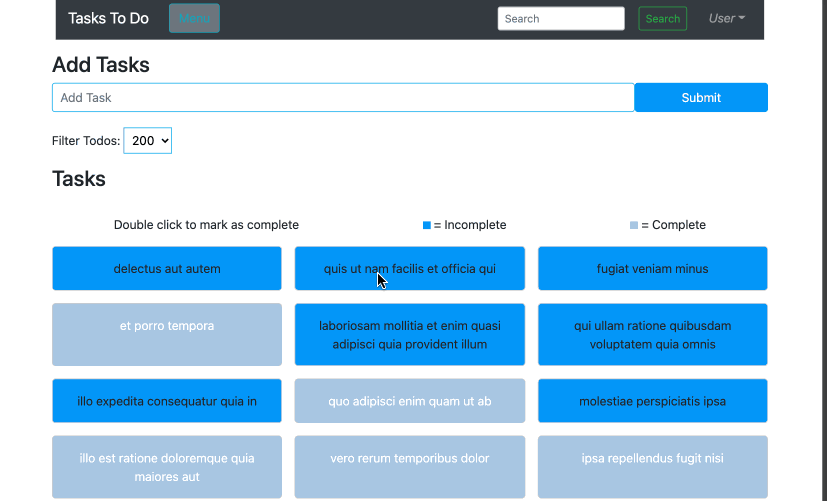

# Vueex Todo App

# About the Author
Name: Samira Mc Queen
[LinkedIn](https://www.linkedin.com/in/samira-mc-queen-1882431a7/)

Free Spririted Caribbean Woman.
Software Developer and aspiring Game Developer

# Project 

## Experience with Project
- This was my first attempt using Vueex State Management. It definitley makes thecoding easier as the State Manager is already installed in the framework that is VueJS.
- I have had other experiences with the framework since and I've learned many more concepts about the framework

# Application Features
- User can filter how many tasks can be shown on the screen
- User can create a task
- User can delete/complete a task

# Frontend Built With
- Vuejs
- Vueex
- Bootstrap-Vue

# Backend Built With
- json file

# Project setup
Once the project is downloaded locally on your device do the following:
`
npm install
`

If there are dependencies that need updating or you want to check:
`
npm outdated
`

If there are outdated dependencies:
`
npm updated
`

To check and update packages in package.json:
`
npx npm-check-updates -u
`

### Compiles and hot-reloads for development
`
npm run start
`

### Compiles and minifies for production
`
npm run build
`

### Lints and fixes files
`
npm run lint
`
